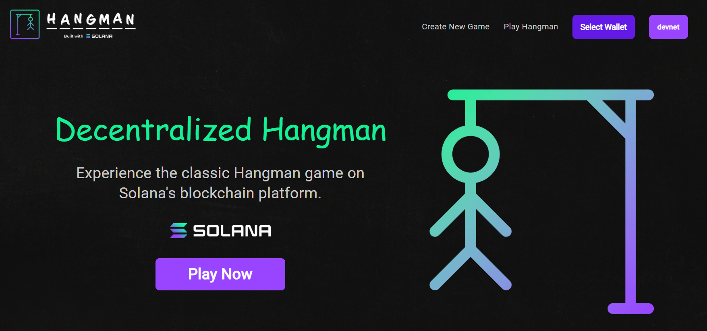

# Solana Hangman Game

This is a decentralized Hangman game built on the Solana blockchain. It was developed as a group project during the [Encode Solana Bootcamp](https://www.encode.club/solana-bootcamp) Q2 2024.

## Play Live

The game is available on Solana devnet and can be played at [solana-hangman.vercel.app](https://solana-hangman.vercel.app/).

## Gameplay

The Hangman game lets players create games with any English word, and they can choose the number of allowed incorrect guesses (3 to 8). Other players can join and play these games, with each guess being recorded as a transaction on the Solana blockchain (devnet).

## Technologies Used

- **Solana Blockchain**: All game actions are stored as transactions on the blockchain.
- **Next.js**: Used for the front-end of the application.
- **create-solana-dapp**: A template for building Solana dapps that helps with integrating blockchain interactions.

## Team

This project was built by:

- [zataara](https://github.com/zataara)
- [lacodajeff](https://github.com/lacodajeff)
- [veronzHub](https://github.com/veronzHub)
